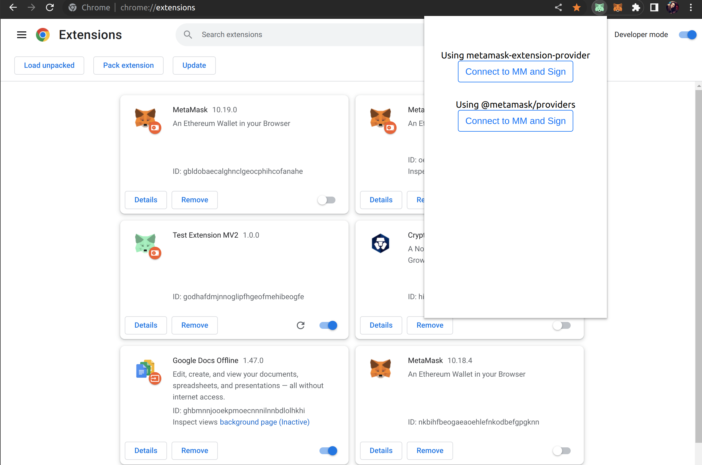

# Test Extension
This is a simple extension that can be used for testing the use of MetaMask provider from another extension.

## Relevant Code
The `extension/src/main.js` file contains the necessary code for importing MetaMask provider. We can test the 2 dependencies:
- `metamask-extension-provider` (legacy one)
- `@metamask/providers`

## Setup
1. Install MetaMask on Chrome
2. Clone this repository
3. Change to extension folder and install dependencies `cd extension npm i`
4. Build the extension `npm run extension`
5. Import extension ***root folder*** into Chrome
6. Click on the Test Extension Icon
7. Right click on the Test Extension and open the developer console
6. Click Connect to MetaMask for testing the desired dependency and check the console

